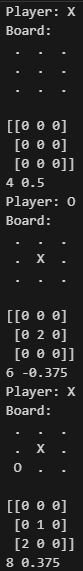
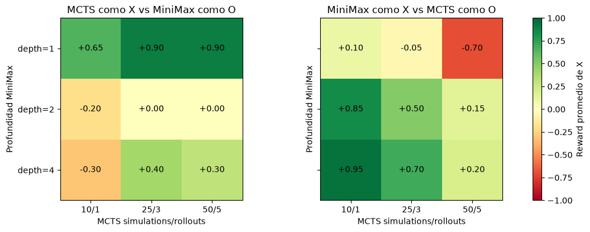
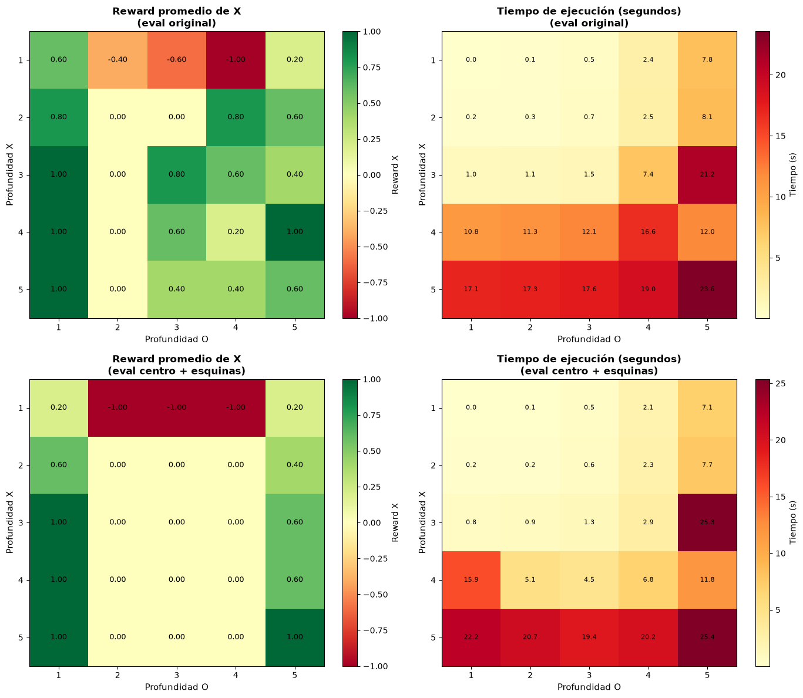
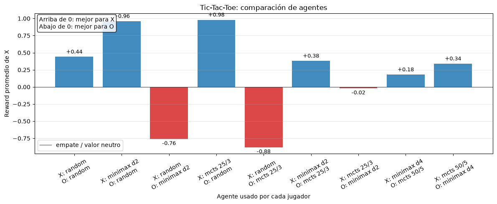
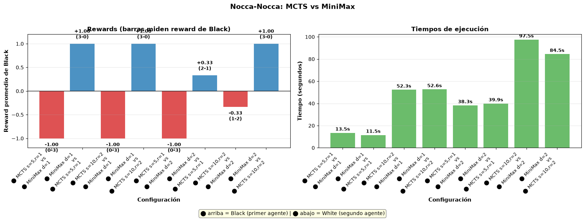
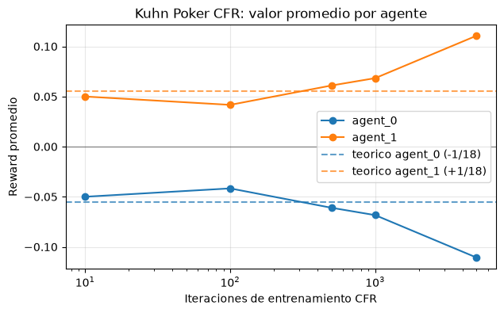
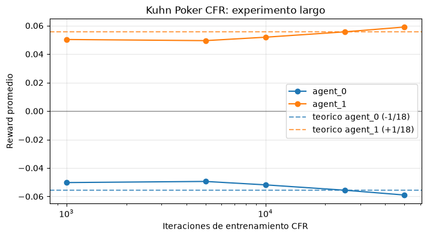
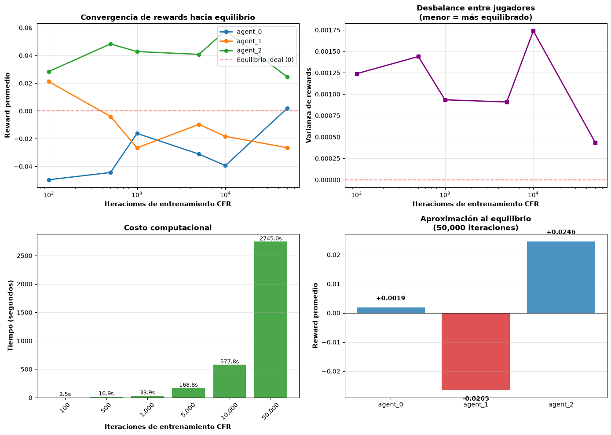
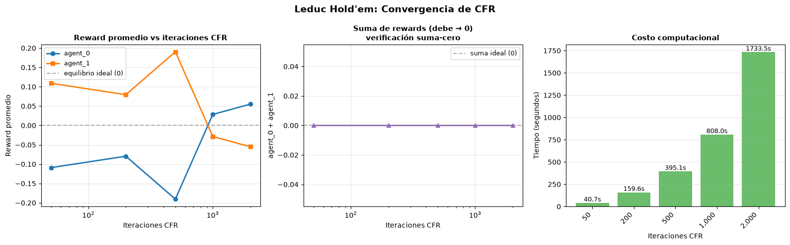

# Obligatorio 2 - Sistemas Multiagente
- Juan Irabedra 212375


## Resumen del documento

Este documento lo estructuro por juego/ambiente. Para cada juego que se pide: TicTacToe, Nocca Nocca, Khun2, Khun3 y Leduc, presento los experimentos que hice, los resultados que obtuve y otros supuestos o conclusiones que saqué de cada uno.

## TicTacToe

Primero, me familiaricé con el estilo de impresión de tableros en la notebook:



Luego, dejé agentes Random jugar 10 juegos entre ellos. Obtuve:

```
Agent X average reward: 0.2 over 10 games

Agent X rewards: [0, 1, 0, -1, -1, 0, 0, 1, 1, 1]

Agent O average reward: -0.2 over 10 games

Agent O rewards: [0, -1, 0, 1, 1, 0, 0, -1, -1, -1]
```

Esto me confirma que el juego se está comportando como suma 0, lo cual es correcto en TicTacToe.

Luego validé con pruebas cortas MiniMax y mi implementación de MCTS.


Lo que concluí de esta primera prueba es que todas mis versiones de agentes MCTS y Minimax le ganan siempre a Random. No siempre le ganan por la misma distancia. Vemos que los Minimax con menor profundidad así como los MCTS con menos cantidad de simulaciones y rollouts ganan por menos diferencia a Random que los Minimax y MCTS con profundidad mayor (2, por ejemplo) o simulaciones/rollouts mayores (50/5). 

También influye qué agente juega primero; pero en cualquier escenario, comparando mismo orden de comienzo, la profundidad mayor o mayor configuración de simulaciones/rollouts de MCTS dan ventaja superior contra el agente Random.

## Minimax vs MCTS

En el siguiente heatmap veo las rewards promedio de algunas configuraciones de Minimax contra configuraciones de MCTS:



En este heatmap veo las rewards promedio del primer agente que juega. En el heatmap de la izquierda es MCTS. En el heatmap de la derecha es Minimax.

Veo que cuando empieza MCTS, le va mejor cuando el minimax tiene poca profundida. A medida que Minimax tiene mayor profundidad, no siempre puedo concluir que MCTS mejora estrictamente, porque veo en Minimax(2) contra MCTS tanto 25/3 como 50/5 que la utilidad esperada no es tan alta. Sin embargo, contra Minimax con profundidad max. 4, veo una mejora para los MCTS mejor tuneados.

Cuando empieza minimax, veo una tendencia mucho más fácil de interpretar: mayor profundidad de minimax me garantiza mayor utilidad esperada contra MCTS idénticos. Es decir, si leo verticalmente el heatmap, las columnas siempre son crecientes a medida que aumenta la complejidad del minimax. Esto se verifica para todos los MCTS que probé.

No estoy seguro por qué, pero minimax es más predecible contra MCTS cuando empieza a jugar.

## Experimentos con Minimax

El siguiente gráfico se puede leer de la siguiente forma: la primera fila usa solamente la función de evaluación original de TicTacToe (la que cuenta líneas aún disponibles para ganar). La segunda fila usa otra función de evaluación (la base + un escalar por tener ocupada la casilla del centro + un escalar por esquinas ocupadas).

Además, compara la utilidad esperada en el heatmap de la izquierda de dos Minimaxes jugando con diferentes combinaciones de profundidades, y a la derecha, para la misma combinación de profundidades se muestra cuánto tiempo toda calcular la utilidad. 



Lo primero que observo sin esfuerzo es que a mayor profundidad, mayor tiempo de ejecución. Es decir, a medida que bajo por el heatmap y me acerco a la derecha, el tiempo de ejecución crece. Crece para ambas funciones de evaluación. Veo que la función de evaluación original es un poco más lenta computacionalmente que la segunda que probé. 

Lo interesante acá son las utilidades. Veo que hay una tendencia a empatar, o estar cerca del empate. Esto tiene sentido porque los agentes intentarán converger a un equilibrio, porque Minimax garantiza eso: un equilibrio Minimax. Sin embargo veo que hay algunos casos anómalos como Minimax(4) vs Minimax(5) con la evaluación original o Minimax(5) vs Minimax(5) con la función de evaluación alternativa. Esto puede tener que ver con el orden de jugadores.


## Comparación de agentes

En esta sección jugué diferentes agentes en diferente orden y calculé la utilidad promedio. Jugaron 50 veces cada combinación de agentes para calcular la utilidad esperada.  

Esta gráfica se lee: viendo los x_ticks del plot puedo ver qué agente juega X y qué agente juega O. Además, veo una barra con la recompensa esperada para el agente que juega X. Es decir, si la barra tiene altura positiva, entonces ganó en promedio X, si no, ganó el agente que jugó O.



Una primera observación valiosa es que nunca gana Random. Luego, cuando juega Minimax(2) contra MCTS(25/3), gana Minimax. Cuando juega Minimax(4) contra MCTS(50/5) gana quien jugó primero. Esto confirma el comportamiento que vimos en el primer heatmap, donde no es tan fácil asegurar si gana MCTS o Minimax sin saber quién juega primero. 

## Experimento para encontrar equilibrio Minimax o de Nash

Por último puse a prueba el equilibrio que conozco de TicTacToe. Para esto hice 3 experimentos:


- Puse a jugar Minimax(9) vs Minimax(9). En 10 juegos tuve 10 empates. Es decir, convergieron al equilibrio. 
- Puse a jugar un Minimax(9) contra un Minimax(3). El Minimax(9) nunca necesitó cambiar su estrategia para ganar. Ganó siempre.
- Hice la matriz de rewards y encontré que cuando permití profundidades altas de ambos Minimax, siempre empatan. 

Entonces, explico que logré probar que con agentes Minimax con profundidad máxima para este juego, hay un equilibrio.


## Nocca Nocca

Primero, me familiaricé con el formato de impresión del tablero:


Luego, validé un par de juegos:

```
MiniMax depth=1 vs Random {'Black': np.float64(1.0), 'White': np.float64(-1.0)}
p0: Random vs MiniMax depth=1 {'Black': np.float64(-1.0), 'White': np.float64(1.0)}
p0: MiniMax depth=2 vs Random {'Black': np.float64(1.0), 'White': np.float64(-1.0)}
p0: Random vs MiniMax depth=2 {'Black': np.float64(-1.0), 'White': np.float64(1.0)}
p0: MCTS sim=5, rollouts=1 vs Random {'Black': np.float64(0.0), 'White': np.float64(0.0)}
p0: Random vs MCTS sim=5, rollouts=1 {'Black': np.float64(-0.2), 'White': np.float64(0.2)}
p0: MCTS sim=10, rollouts=2 vs Random {'Black': np.float64(1.0), 'White': np.float64(-1.0)}
p0: Random vs MCTS sim=10, rollouts=2 {'Black': np.float64(-0.6), 'White': np.float64(0.6)}
p1: MiniMax depth=1 vs Random {'Black': np.float64(1.0), 'White': np.float64(-1.0)}
p1: Random vs MiniMax depth=1 {'Black': np.float64(-1.0), 'White': np.float64(1.0)}
p1: MiniMax depth=2 vs Random {'Black': np.float64(1.0), 'White': np.float64(-1.0)}
p1: Random vs MiniMax depth=2 {'Black': np.float64(-1.0), 'White': np.float64(1.0)}
p1: MCTS sim=5, rollouts=1 vs Random {'Black': np.float64(0.2), 'White': np.float64(-0.2)}
p1: Random vs MCTS sim=5, rollouts=1 {'Black': np.float64(0.2), 'White': np.float64(-0.2)}
p1: MCTS sim=10, rollouts=2 vs Random {'Black': np.float64(1.0), 'White': np.float64(-1.0)}
p1: Random vs MCTS sim=10, rollouts=2 {'Black': np.float64(-0.6), 'White': np.float64(0.6)}
p0: MiniMax depth=1 con eval movilidad {'Black': np.float64(0.2), 'White': np.float64(-0.2)}
```

Revisé que el juego se comporte realmente como suma 0 y jugué con las funciones de evaluación. 

### Funciones de evaluación

#### Componentes individuales

Tres métricas base definidas en `nocca_nocca.py`, todas en [0, 1]:

- **`_eval_progress`**: progreso promedio normalizado de todas las piezas propias hacia la fila meta/del oponente.
- **`_eval_closest_to_goal`**: progreso normalizado de la pieza propia más avanzada. Es interesa porque refleja la condición de victoria: que una pieza llegue a la meta del otro.
- **`_eval_blocked`**: fracción de piezas propias con una pieza rival encima en la misma pila (bloqueadas).

#### Funciones de evaluación usadas

| Nombre | Fórmula | Notas |
|---|---|---|
| **`eval_base`** (default) | `0.5 · progress − 0.5 · blocked` | Evalúa solo al agente propio |
| **`eval_closest`** | `closest` | Solo la pieza más avanzada; ignora las demás |
| **`eval_progress_closest`** | `0.5 · progress + 0.5 · closest` | Pondera avance global y avance de la que mejor va |
| **`eval_progress_closest_blocked`** | `0.35 · progress + 0.45 · closest − 0.20 · blocked` | Agrega penalización por bloqueo |
| **`eval_relative`** | `score(agente) − score(rival)` con pesos `closest=0.45, progress=0.35, blocked=0.20` | Diferencial respecto al rival; suma-cero natural |
| **`NoccaNoccaRelativeEval.eval`** | `own_score − opp_score + 0.20 · mobility` | `own_score = 0.50·closest + 0.30·progress − 0.20·blocked`; `mobility = (movs_propios − movs_rival) / (movs_propios + movs_rival)` ∈ [−1, 1] |

En todas tuve que elegir ponderadores para cada componente. Los elegí cercanos a 1/n siendo n la cantidad de componentes. No hice tuneo de estos componentes porque me pareció que era mejor experimentar con agentes que con finetuning de parámetros de funciones de evaluación.


### Evaluación de Minimax

Primero, puse a jugar Minimaxes entre ellos con diferentes profundidades hasta 2. Usé dos evaluaciones: la base y la de comparación relativa con el rival.


El problema con Nocca Nocca es que hacer el minimax con profundidades altas se vuelve infactible. Al final de la notebook menciono alphabeta pruning como mejora; la implementé pero también me encontré con que explota para profundidades altas (4, 5 ya se vuelve imposible).

A pesar de la experimentación, no veo patrones que pueda extraer de la experimentación hasta profundidad 2, con ninguna de las funciones de evaluación. Me hace sentido por la poca profundidad del árbol que estoy usando.

### Evaluación de Minimax, MCTS y Random

Hice una corrida de Minimaxes, MCTS y Randoms entre ellos. Al ser agentes poco poderosos en el sentido de que o bien tienen pocos rollouts/sims o bien tienen poca depth, hubo partidas truncadas en 80 steps. Eso explica por qué algunas configuraciones no llegan a reward 1. Fuera de esto, no hay mucho para concluir a partir de esta gráfica.


### Evaluación de Minimax vs MCTS

Luego, largué 3 juegos para cada configuración de par de agentes. De nuevo 80 pasos. Siempre comenza Black.



Con los parámetros que fui probando, Minimax siempre desempeña mejor que MCTS para Nocca Nocca cuando juegan entre ellos. Y en general, los modelos más simples son mucho más rápidos.

A diferencia de TicTacToe, acá quien empieza no cambia mucho. Aunque Black y White cambien de lugar, siempre gana el mismo algoritmo (Minimax).


### Heatmap Minimax de Nocca Nocca

Finalmente hice el heatmap de rewards promedio de Nocca Nocca Minimax. Veo que ningún juego se trunca, entonces siempre gana o siempre pierde, entonces obtiene rewards 1 o -1. No tengo más ideas para extraer de este experimento.


### Alpha Beta pruning en Nocca Nocca

Armé con Claude un ejemplo de implementación de Alpha Beta Pruning. Esto es porque quería acercarme a alguna prueba de un equilibrio de Nash o equilibrio Minimax en Nocca Nocca. No estaba 100% seguro cuánto podía mejorar con Alpha-Beta. Al final, concluí que también es inviable calcular el equilibrio de esta manera. Así que no terminé implementando formas empíricas de calcular o encontrar el equilibrio en este juego 


## Khun Poker para 2 jugadores

Primero probé hacer render de jugadas del juego:

```
agent_0 K 
agent_1 J 
Agent agent_0
Action 0 - move p
agent_0 K p
agent_1 J p
Agent agent_1
Action 1 - move b
agent_0 K pb
agent_1 J pb
Agent agent_0
Action 1 - move b
agent_0 K pbb
agent_1 J pbb
Reward agent_0 = 2
Reward agent_1 = -2
```

Luego entrené CFR con 1000 iteraciones para cada agente y observé la política aprendida por infoset. Cada clave es la carta del jugador más el historial de acciones (p = pass, b = bet); el array es `[P(pass), P(bet)]`:

```
Training agent agent_0
{'2': [0.003, 0.997], '0': [0.997, 0.003], '1': [0.829, 0.171],
 '0p': [0.993, 0.007], '2p': [0.003, 0.997], '1p': [0.978, 0.022],
 '0b': [0.996, 0.004], '2b': [0.006, 0.994], '1b': [0.020, 0.980],
 '0pb': [0.997, 0.003], '2pb': [0.444, 0.556], '1pb': [0.003, 0.997]}
```

La política tiene sentido intuitivo: con carta alta (2) apuesta casi siempre, con carta baja (0) pasa o foldea casi siempre, y con carta media (1) usa una estrategia mixta.

### Convergencia al equilibrio de Nash

Kuhn Poker de 2 jugadores tiene un valor teórico conocido: `−1/18 ≈ −0.0556` para el jugador inicial y `+1/18` para el segundo. Entrené CFR con distintas cantidades de iteraciones y medí qué tan cerca llegaba del valor teórico.



Con 25.000 iteraciones el error absoluto cae a 0.00004, prácticamente en el equilibrio. La convergencia es clara y consistente: a más iteraciones, menor error. Esto valida que CFR implementado correctamente encuentra el equilibrio de Nash.




### Comparación de agentes: CFR, MCTS y Random

Comparé CFR, MCTS y Random en 1000 partidas cada configuración:

```
   cfr vs cfr    | value agent_0=-0.068 | value agent_1=+0.068
   cfr vs mcts   | value agent_0=-0.140 | value agent_1=+0.140
  mcts vs cfr    | value agent_0=+0.069 | value agent_1=-0.069
  mcts vs mcts   | value agent_0=-0.015 | value agent_1=+0.015
   cfr vs random | value agent_0=+0.056 | value agent_1=-0.056
random vs cfr    | value agent_0=-0.133 | value agent_1=+0.133
  mcts vs random | value agent_0=+0.190 | value agent_1=-0.190
random vs mcts   | value agent_0=-0.360 | value agent_1=+0.360
random vs random | value agent_0=+0.121 | value agent_1=-0.121
```


CFR vs CFR converge cerca del valor teórico (−0.068 vs −0.056 teórico). CFR siempre le gana a Random independientemente de quién empiece.

Una aclaración importante sobre MCTS acá: el MCTS implementado usa clones del estado completo del juego durante la búsqueda, es decir, ve las cartas del rival. Eso **no es correcto** para un juego de información imperfecta como Kuhn Poker. Por eso los resultados de MCTS no representan un agente bien diseñado para este juego sino un baseline experimental. Cuando MCTS juega contra CFR, los valores anómalos (−0.14 o +0.069 según posición) reflejan que MCTS explota o es explotado dependiendo de si actúa primero o segundo, no que sea mejor o peor estratégicamente.

### Comparación con ISMCTS

ISMCTS (*Information Set MCTS*) es la versión correcta para información imperfecta: en vez de clonar el estado completo, en cada simulación remuestrea la carta privada del rival para que sea compatible con lo que sabe el agente. Es un approach más honesto para Poker.

```
   cfr vs ismcts | value agent_0=+0.008 | value agent_1=-0.008
ismcts vs cfr    | value agent_0=-0.114 | value agent_1=+0.114
ismcts vs ismcts | value agent_0=-0.004 | value agent_1=+0.004
ismcts vs mcts   | value agent_0=-0.218 | value agent_1=+0.218
  mcts vs ismcts | value agent_0=+0.188 | value agent_1=-0.188
ismcts vs random | value agent_0=+0.180 | value agent_1=-0.180
random vs ismcts | value agent_0=-0.324 | value agent_1=+0.324
```


CFR vs ISMCTS da +0.008 (prácticamente 0), frente al −0.14 de CFR vs MCTS. Eso muestra que ISMCTS se acerca mucho más al equilibrio que MCTS estándar. Cuando ISMCTS juega contra MCTS, ISMCTS gana claramente porque maneja la incertidumbre de forma correcta.


## Khun Poker para 3 jugadores

Kuhn de 3 jugadores usa 4 cartas (J, Q, K, A) y 3 agentes que juegan en orden. Primero probé una partida para verificar el ambiente:

```
Mano inicial: {'agent_0': 'J', 'agent_1': 'K', 'agent_2': 'A'}
agent_0 juega 0 (p)
agent_1 juega 0 (p)
agent_2 juega 0 (p)
Historial: ppp
Rewards: {'agent_0': -1, 'agent_1': -1, 'agent_2': 2}
Suma de rewards: 0
```

El juego es de suma cero, como ya sabía

### Comparación de agentes

Comparé CFR, ISMCTS y Random en 1000 partidas por configuración:

```
CFR vs CFR vs CFR            | avg={'agent_0': -0.012, 'agent_1': -0.023, 'agent_2': +0.035}
ISMCTS vs ISMCTS vs ISMCTS   | avg={'agent_0': -0.080, 'agent_1': +0.004, 'agent_2': +0.076}
CFR vs CFR vs Random         | avg={'agent_0': +0.086, 'agent_1': +0.119, 'agent_2': -0.205}
ISMCTS vs ISMCTS vs Random   | avg={'agent_0': +0.219, 'agent_1': +0.256, 'agent_2': -0.475}
Random vs Random vs Random   | avg={'agent_0': +0.151, 'agent_1': +0.049, 'agent_2': -0.200}
```


Veo que agent_2 (el último en jugar) tiende a tener mejor reward en las configuraciones simétricas. Esto tiene sentido: actuar último da más información sobre las acciones de los demás. Random siempre pierde contra agentes buenos, con reward promedio cerca de −0.2 a −0.5 dependiendo de con quién juega.

### Convergencia al equilibrio de Nash

A diferencia del caso de 2 jugadores, no existe una fórmula analítica para el valor de equilibrio en 3 jugadores. CFR debería converger a un equilibrio de Nash donde los rewards promedio de todos los jugadores se aproximan a 0.



Con suficientes iteraciones, los rewards de CFR se acercan a 0 para todos los agentes, lo cual es consistente con la convergencia al equilibrio. No puedo comparar contra un valor teórico exacto, pero eso interpreto de la gráfica.


## Leduc Hold'em

Leduc es una versión reducida de poker de información imperfecta. Tiene 2 jugadores y un mazo con pares de cartas J, Q y K (6 cartas en total). Cada jugador recibe una carta privada, hay una primera ronda de apuestas, se revela una carta pública y hay una segunda ronda. Gana quien tenga el par (carta privada = carta pública) o, si nadie tiene par, la carta más alta. También se puede ganar antes si el rival foldea.

Las acciones disponibles por turno son: `0 = call`, `1 = raise`, `2 = fold`, `3 = check`.

Una nota importante sobre ISMCTS en Leduc: el método `random_change()` que ISMCTS necesita para remuestrear las cartas ocultas del rival no está implementado en Leduc, así que ISMCTS termina clonando el mismo estado oculto siempre. Este es un problema que tiene ISMCTS en este juego. Igual avancé sabiendo esto, pero hay que considerar esta salvedad en todos los análisis.

### Comparación de agentes

```
   cfr vs cfr    | value agent_0=-0.166 | value agent_1=+0.166
   cfr vs ismcts | value agent_0=-0.783 | value agent_1=+0.783
ismcts vs cfr    | value agent_0=+1.053 | value agent_1=-1.053
   cfr vs random | value agent_0=-0.108 | value agent_1=+0.108
random vs cfr    | value agent_0=-0.203 | value agent_1=+0.203
ismcts vs random | value agent_0=+0.872 | value agent_1=-0.872
random vs ismcts | value agent_0=-0.991 | value agent_1=+0.991
```


Lo primero que llama la atención son los valores extremos de ISMCTS: +1.053 cuando juega primero contra CFR y −0.783 cuando juega segundo. Esto puede ser  efecto del bug de `random_change()`: al clonar siempre el mismo mundo oculto, explota el estado fijo como forzándolo. Por eso los resultados de ISMCTS en Leduc no son comparables con los de Kuhn2/3.

CFR vs CFR muestra que agent_1 tiene ventaja (−0.166 vs +0.166), probablemente por la ventaja de actuar después en las rondas de apuesta. CFR siempre le gana a Random independientemente del orden.

### Convergencia de CFR

A diferencia de Kuhn22, Leduc no tiene un valor analítico conocido como referencia. Observé cómo evolucionan los rewards promedio a medida que aumento las iteraciones de entrenamiento.

```
iters=  1000 | agent_0=-0.0750 | agent_1=+0.0750 | suma=0.0000
iters=  5000 | agent_0=-0.0080 | agent_1=+0.0080 | suma=0.0000
iters= 10000 | agent_0=-0.1130 | agent_1=+0.1130 | suma=0.0000
iters= 25000 | agent_0=-0.1325 | agent_1=+0.1325 | suma=0.0000
iters= 50000 | agent_0=+0.0615 | agent_1=-0.0615 | suma=0.0000
```



La suma de rewards es siempre 0 (suma cero), lo cual es correcto. Los valores oscilan bastante más que en Kuhn, lo cual tiene sentido: Leduc es un juego más complejo con más infosets y con pocas iteraciones CFR no alcanza a visitar todos. Con 2000 iteraciones todavía no hay convergencia clara a un valor estable, lo que muestra que Leduc requiere muchas más iteraciones que Kuhn para que CFR estabilice la política.
